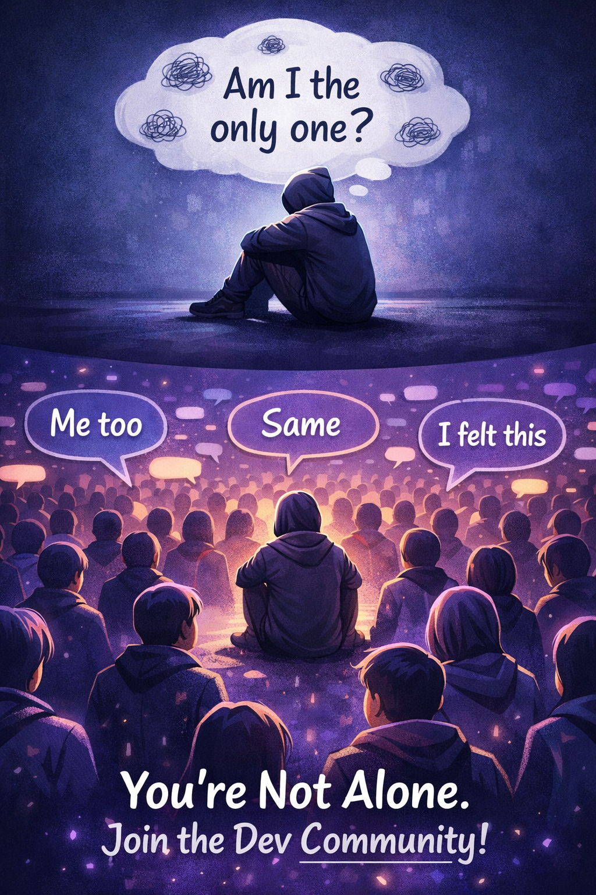
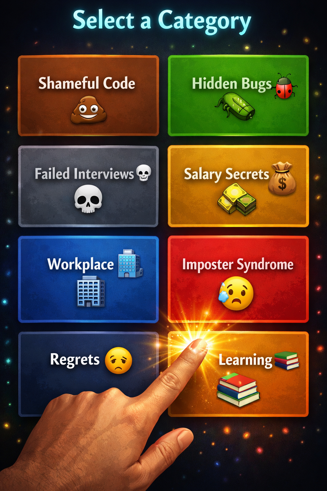

<!-- Hero Banner -->
<!--
  📸 IMAGE SETUP: Upload your banner image to GitHub repo's /images folder
  Available local file: frontend/public/og-image.png (recommended for banner)
  After upload, use: ./images/og-image.png
-->

  

# 🤫 DevConfessions

### *The Anonymous Safe Space for Developer Confessions*

 

<!-- Big CTA Buttons -->

  

  

<!-- Social Proof Badges -->

 

---

**Finally, a place to admit that bug you never fixed.** 🐛

*Share your shameful code, failed interviews, imposter syndrome, and salary secrets—completely anonymously. No login. No tracking. No judgment.*

---

 

## 😨 We've All Been There

> *"I've been a senior engineer for 5 years, and I still Google how to center a div."*

> *"I shipped a bug to production 3 months ago. It's still there. Nobody has noticed."*

> *"I failed 12 interviews before landing my job. LinkedIn shows none of that."*

**The tech industry only shows highlight reels.** DevConfessions is for the real stories.

 

---

## 📱 See It In Action

<!--
  📸 APP SCREENSHOTS SETUP:
  Upload your Play Store screenshots from frontend/assets/Playstore assets/ to GitHub repo's /images folder.
  
  Available local files:
  - frontend/assets/Playstore assets/1.png (Home Feed)
  - frontend/assets/Playstore assets/2.png (Categories)
  - frontend/assets/Playstore assets/3.png (Post Confession)
  - frontend/assets/Playstore assets/4.png (Tracking)
  - frontend/assets/Playstore assets/5.png through 9.png (Additional screens)
  - frontend/assets/Playstore assets/Devconfession feature.png (Feature graphic)
  
  After uploading to GitHub, update paths below to: ./images/1.png, ./images/2.png, etc.
-->
<table>
  <tr>
    <td align="center">
      
       <b>Browse Confessions</b>
    </td>
    <td align="center">
      
       <b>8 Categories</b>
    </td>
    <td align="center">
      
       <b>Post Anonymously</b>
    </td>
    <td align="center">
      
       <b>Secret Tracking</b>
    </td>
  </tr>
</table>

 

*Dark theme • Infinite scroll • Pull to refresh • Native Android app*

 

---

## 🏷️ Confession Categories

| | Category | What Developers Confess |
|---|----------|------------------------|
| 💩 | **Shameful Code** | That regex from Stack Overflow you don't understand |
| 🐛 | **Hidden Bugs** | The ones you know about but... haven't fixed |
| 💀 | **Failed Interviews** | That FAANG rejection you never told anyone about |
| 💰 | **Salary** | What you really earn (finally, transparency) |
| 🏢 | **Workplace** | Dysfunctional teams, absurd managers, corporate chaos |
| 😨 | **Imposter Syndrome** | Feeling like a fraud despite the title |
| 😔 | **Career Regrets** | The startup you didn't join, the language you didn't learn |
| 📚 | **Learning** | Those "basic" things you still don't know |

 

---

## ✨ Why Developers Love DevConfessions

| Feature | Why It Matters |
|---------|----------------|
| 🔒 **100% Anonymous** | No login, no account, no email, no tracking whatsoever |
| 🚫 **Zero Ads Forever** | No banners, no popups, no "premium" upsells |
| 📊 **Secret Tracking URL** | See your confession's views, upvotes, comments—privately |
| 🗑️ **Delete Anytime** | Your confession, your control—remove it whenever you want |
| 💬 **Anonymous Comments** | Support others without revealing yourself |
| 🌙 **Beautiful Dark Theme** | Easy on the eyes for late-night browsing |
| 📱 **Native Mobile App** | Smooth Android experience on Google Play |
| 🔗 **QR Code Sharing** | Share confessions IRL or on social media |

 

---

## 💭 What Developers Are Saying

> ⭐⭐⭐⭐⭐ *"Finally, somewhere I can admit I copy-paste from ChatGPT without judgment."*
>
> — Anonymous Developer

 

> ⭐⭐⭐⭐⭐ *"Reading other people's imposter syndrome confessions made me realize I'm not alone."*
>
> — Anonymous Developer

 

> ⭐⭐⭐⭐⭐ *"The salary confessions helped me negotiate a 20% raise. Transparency matters."*
>
> — Anonymous Developer

 

---

## 🚀 Ready to Confess?

 

### Try it now — no signup required

  

### Or download the Android app

  

---

### 🔗 Quick Links

| | |
|---|---|
| 🌐 **Website** | https://devconfessions.getinfotoyou.com |
| 📱 **Play Store** | [Download Android App](https://play.google.com/store/apps/details?id=com.getinfotoyou.devconfessions) |
| 🔒 **Privacy Policy** | [Read Here](https://devconfessions.getinfotoyou.com/privacy) |
| 💬 **Support** | [Contact Us](https://devconfessions.getinfotoyou.com/support) |

---

 

**Made with ❤️ for the developer community**

*Because the best developers aren't perfect—they're just honest about being human.*

 

⭐ **Star this repo** to help other developers find their safe space!

